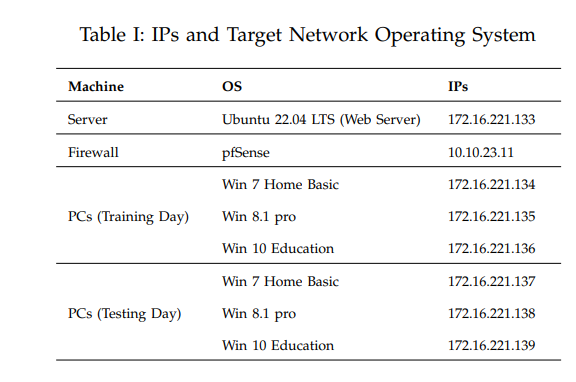

# CRCDDoS2022
# Developing Realistic Distributed Denial of Service (DDoS) Dataset for Machine Learning-based Intrusion Detection Systems
## Executive summary 

During the last decade, attackers have compromised reputable systems to launch massive Distributed Denial of Services (DDoS) attacks against banking services, corporate websites, and e-commerce business. Such attacks cause enormous reputation and financial losses which ruined their services to authorized users. Conventionally, diverse solutions have been proposed to combat emerging DDoS attacks. However, there is no ideal solution available to-date. To validate majority of
the existing solutions, researchers have considered simulation based experiments that become obsolete. Now a days, the trend has shifted to publicly available realistic datasets for DDoS validation purpose. Thus, in this research study, we have provided a comprehensive review of currently available datasets and
proposed a novel taxonomy for classification of DDoS attacks. Further, we generated a new dataset called “CRCDDoS2022”, which can overcome all existing shortcomings. Moreover, a novel generated dataset “CRCDDoS2022” can overcome shortcomings.
Moreover, with this new dataset, a new attack (Malware) family
classification and detection approach is also provided which based
on the set of features in network flow. Lastly, this research
provided the most significant feature sets for the detection of
DDoS attacks of various types along with their corresponding
weights . 

<h2>Testbed </h2>

Modern simulators (HOIC, Slowloris, DDoSIM, Mass,
Golden eye, Bonesi, Mirai Botnet, Tor Hammer) are
used for creating real world attack simulation. These
simulators are strong, simple to utilize and produces
realistic application traffic as well as attacks for testing
performance, versatility along with security of application oriented networks. These simulators are the industry perceived world’s most powerful performing test
systems for OSI layer 3-7 arrangement, and it imitates
real application traffic. These have separate library of
thousands of practical applications as well as attack
vectors and are daily updated to guarantee load and
utilitarian testing with unparalleled versatility.
In DDoS attacks, attackers try to evade servers which
causes a lot of network bandwidth consumption due to
ingress and egress traffic. By utilizing these test systems,
the network architecture was simultaneous and simplified, a full network topology was created, as recommended for advancement of the effective dataset. Interestingly, these simulators can imitate hundred thousand
attacks every second from Mac addresses and IP spoofing, with different protocols/traffic. The testbed permits
load balance for attacks and benign traffic. Through such
many choices, the test system produces real time traffic
through full convention stacks. Figure 1 presents the
newly developed testbed for DDoS attack scenarios.
The attacker group (172.16.221.108) and victim group
are two network groups utilized in this test system.
Simplified configurations were used in the victim network such as Linux (172.16.221.133). Likewise, Windows
servers (172.16.221.133) with PCs (172.16.x.x) were used.
SMTP, DNS, and web services are provided by the Linux
server. In contrast, Windows server only provide web
services. The significant connectivity to the victim network from attack group is acknowledged with 10Gbps
fiber network for developing attack scenarios bearing
maximum load to 10Gbps approximately. The outgoing
and incoming traffic is captured through mirror port
with the help of tcpdump. Table 1 presents a list of
workstations, servers and firewalls with their operating
system as well as associated private and public IPs in
testing and training days.
  

The third party executed the assault families in testing
and training days. The Victim network comprises one
server (Web server), two switches, one firewall and four
PCs. Likewise, one port in the fundamental switch of
the Victim network is configured as the mirror port and
dedicatedly captures all incoming and outgoing traffic
to a network.

 *Testbed*  

   

